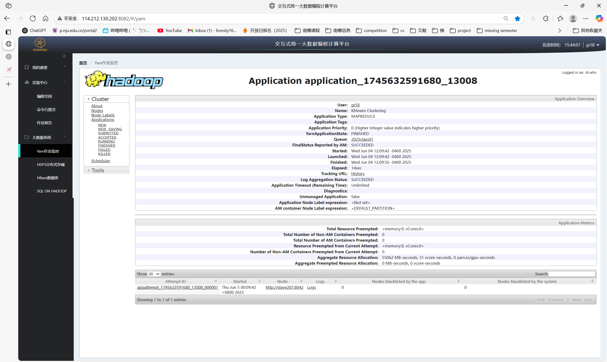
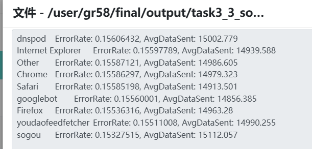
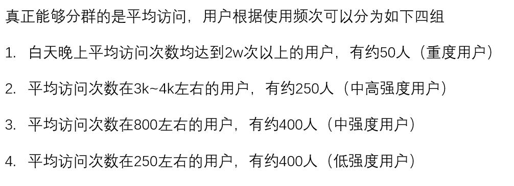

# 大数据课程设计2——LogAnalysis

## 目录
- [大数据课程设计2——LogAnalysis](#大数据课程设计2loganalysis)
  - [目录](#目录)
  - [小组信息\&分工情况](#小组信息分工情况)
    - [小组信息](#小组信息)
    - [分工情况](#分工情况)
  - [详细设计说明](#详细设计说明)
    - [Task1](#task1)
    - [Task2](#task2)
    - [Task3\_part1](#task3_part1)
        - [Mapper设计](#mapper设计)
        - [Reducer设计](#reducer设计)
        - [Partitioner设计](#partitioner设计)
        - [输出结果截图](#输出结果截图)
    - [Task3\_part2](#task3_part2)
      - [Mapper设计](#mapper设计-1)
      - [Reducer设计](#reducer设计-1)
      - [Partitioner设计](#partitioner设计-1)
      - [输出结果截图](#输出结果截图-1)

## 小组信息&分工情况
项目地址：https://github.com/Jaderest/LogAnalysis
### 小组信息
- TODO （别盒我😭😭😭）


### 分工情况
- TODO


## 详细设计说明
- 本实验四个任务均采用MapReduce框架实现，环境如下
```
hadoop version: 3.2.1
openjdk version "1.8.0_452"
Apache Maven 3.6.3
```
- 基本框架为
  - Mapper
  - Partitioner（根据key将Mapper分出的内容传给不同的Reducer，由此提高代码的可扩展性，在更大的集群上也具有同样的扩展性）
  - Combiner（可选，通常用于对Mapper的输出进行局部聚合，减少传输数据量，此处仅用于K-means聚类算法中）
  - Reducer
  - Driver（负责将Mapper和Reducer连接起来，设置输入输出路径等）


### Task1


### Task2


### Task3_part1
分析传输数据量与状态码的关系：根据body_bytes_sent字段和status字段，分析请求失败与大文件传输是否相关。

设计思路：根据状态码进行区分，统计每个状态码对应的body_bytes_sent字段的平均值，分析传输数据量与状态码的关系。使用`两个Reducer`对数据进行处理，一个Reducer处理状态码为2xx的请求（成功请求），另一个Reducer处理状态码为4xx和5xx的请求（失败请求）。

##### Mapper设计
- LogMapper类
  - 输入键值对：`(LongWritable, Text)`，其中LongWritable为行号，Text为原始日志行内容
  - 输出键值对：`(Text, FloatWritable)`，其中Text为状态码，FloatWritable为body_bytes_sent字段的值
- 原始代码如下
```java
Matcher matcher = logPattern.matcher(value.toString());
if (matcher.find()) {
    String status = matcher.group(6); // 通过正则表达式获取状态码
    String bodyBytesSent = matcher.group(7); // 获取body_bytes_sent字段
    float dataSent = Float.parseFloat(bodyBytesSent);
    context.write(new Text(status), new FloatWritable(dataSent));
}
```

##### Reducer设计
- LogReducer类
  - 输入键值对：`<Text, Iterable<FloatWritable>>`，其中Text为状态码，Iterable<FloatWritable>为所有相同状态码的body_bytes_sent值
  - 输出键值对：`<Text, FloatWritable>`，其中Text为状态码，FloatWritable为body_bytes_sent的平均值
- 代码如下
```java
float sum = 0;
int count = 0;
for (FloatWritable value : values) { // 统计同一状态码的所有发送数量
    sum += value.get();
    count++;
}
float average = sum / count;
context.write(key, new FloatWritable(average));
```

##### Partitioner设计
- 根据状态码进行分组
- 代码如下
```java
if (status.equals("200") || status.equals("201") || status.equals("202") || status.equals("204")) {
    return 0;
} else {
    return 1;
}
```

##### 输出结果截图
- 输出结果为两个文件，分别对应状态码为2xx和4xx/5xx的请求
- 成功请求（2xx）输出示例：

- 失败请求（4xx/5xx）输出示例：

- 分析如下：
  - 请求成功失败与否和传输数据量并无太大关系
  - 只有一个499状态码比较可疑，499状态码通常出现在 Nginx 服务器日志中，表示 客户端主动关闭了请求连接
    - 同时客户端传输数据量较大，可能是因为客户端在传输大文件时超时，或是服务器生成大响应（如复杂查询、文件下载）耗时过长，导致用户失去耐心

### Task3_part2
本任务以小时为粒度统计错误请求占比（即错误率），通过排序分析不同时间段内的错误率波动情况


#### Mapper设计
- 输入键值对：`<LongWritable, Text>`
- 输出键值对：`<Text, IntWritable>` Text表示时间段，IntWritable表示是否错误，不是错误则为0，是错误则为1
- 代码如下
```java
String status = matcher.group(6); // 请求状态码
String timeLocal = matcher.group(4); // 获取访问时间
// 将访问时间转换为小时
Date date = sdf.parse(timeLocal);
String hour = new SimpleDateFormat("HH").format(date);

// 如果请求状态是失败（非200系列），则认为是错误
int isError = (status.startsWith("2")) ? 0 : 1;

// 输出时间段（小时）和错误计数
context.write(new Text(hour), new IntWritable(isError));
```

#### Reducer设计
- 对相同小时所有记录进行聚合
- 输入键值对：`Text, [IntWritable(isError)...]>`，其中Text为小时，IntWritable为是否为错误
- 输出键值对：`<Text, FloatWritable>`，输出小时和平均错误率
```java
int totalRequests = 0;
int failedRequests = 0;

for (IntWritable value : values) {
    totalRequests++;
    if (value.get() == 1) {
        failedRequests++;
    }
}

float errorRate = totalRequests > 0 ? (float) failedRequests / totalRequests : 0.0f;
context.write(key, new FloatWritable(errorRate));
```

#### Partitioner设计
LogPartitioner 将小时划分为白天（08~22）与夜间（00~07和23）两类，分别交由两个Reducer处理，以便观察昼夜之间错误率的差异。
```java
int hour = Integer.parseInt(key.toString());
// 将小时分为两组：8-22点 和 0-7点、23点
if (hour >= 8 && hour <= 22) {
    return 0; // 白天时间段
} else {
    return 1; // 夜间时间段
}
```

#### 输出结果截图


