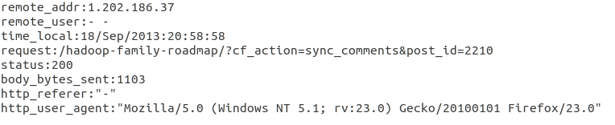
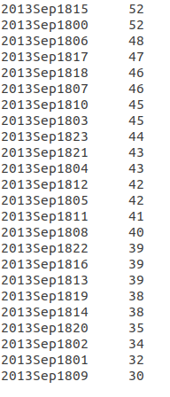
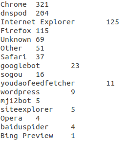
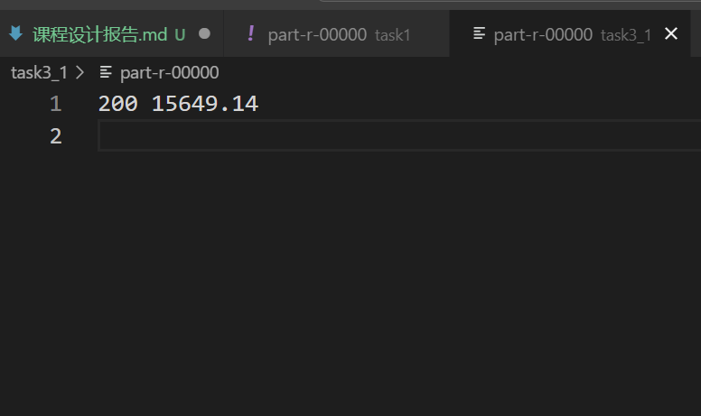
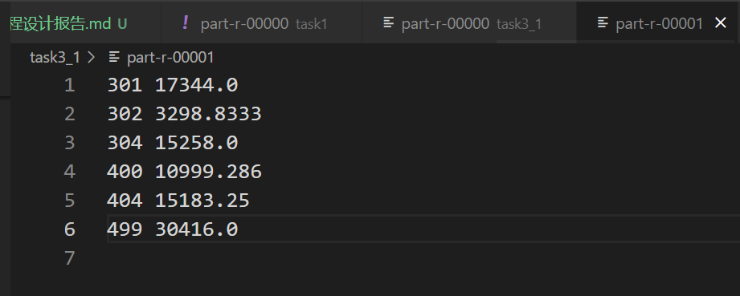
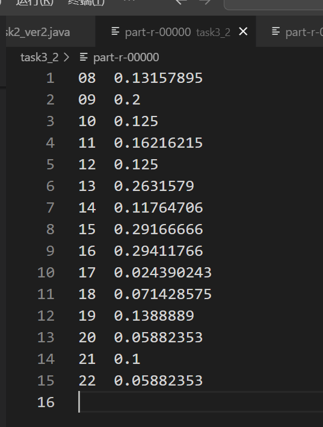
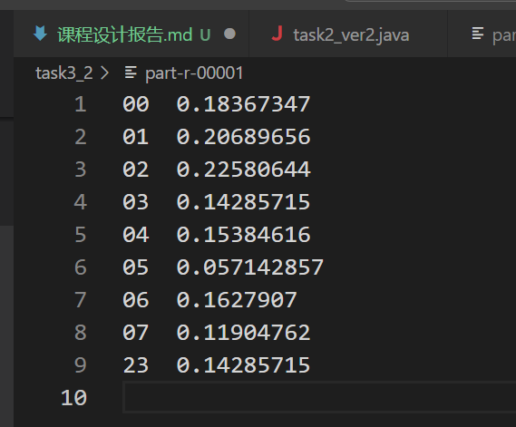

# 大数据课程设计2——LogAnalysis

## 目录
- [大数据课程设计2——LogAnalysis](#大数据课程设计2loganalysis)
  - [目录](#目录)
  - [小组信息\&分工情况](#小组信息分工情况)
    - [小组信息](#小组信息)
    - [分工情况](#分工情况)
  - [详细设计说明](#详细设计说明)
    - [task1](#task1)
      - [Mapper设计](#mapper设计)
      - [Reducer设计](#reducer设计)
      - [Partitioner设计](#partitioner设计)
      - [输出结果截图](#输出结果截图)
    - [task2](#task2)
      - [代码设计](#代码设计)
        - [每小时网站浏览量](#每小时网站浏览量)
        - [访问网站的用户端类型](#访问网站的用户端类型)
        - [整合统计数据](#整合统计数据)
        - [排序实现](#排序实现)
      - [输出结果截图](#输出结果截图-1)
    - [Task3\_part1](#task3_part1)
      - [Mapper设计](#mapper设计-1)
      - [Reducer设计](#reducer设计-1)
      - [Partitioner设计](#partitioner设计-1)
      - [输出结果截图](#输出结果截图-2)
    - [Task3\_part2](#task3_part2)
      - [Mapper设计](#mapper设计-2)
      - [Reducer设计](#reducer设计-2)
      - [Partitioner设计](#partitioner设计-2)
      - [输出结果截图](#输出结果截图-3)

## 小组信息&分工情况
项目地址：https://github.com/Jaderest/LogAnalysis
### 小组信息
- TODO （别盒我😭😭😭）


### 分工情况
- TODO


## 详细设计说明
- 本实验四个任务均采用MapReduce框架实现，环境如下
```
hadoop version: 3.2.1
openjdk version "1.8.0_452"
Apache Maven 3.6.3
```
- 基本框架为
  - Mapper
  - Partitioner（根据key将Mapper分出的内容传给不同的Reducer，由此提高代码的可扩展性，在更大的集群上也具有同样的扩展性）
  - Combiner（可选，通常用于对Mapper的输出进行局部聚合，减少传输数据量，此处仅用于K-means聚类算法中）
  - Reducer
  - Driver（负责将Mapper和Reducer连接起来，设置输入输出路径等）


### task1

解析Nginx日志文件，提取关键字段信息，根据客户端IP地址进行数据分区处理，以此实现日志数据的结构化输出

设计思路：
使用正则表达式匹配提取包括IP地址、访问时间、请求URL、状态码等关键字段，同时根据IP地址的第一个八位字节实现数据分区

#### Mapper设计
- LogMapper类
  - 输入键值对：`<LongWritable, Text>`，`LongWritable`为行号，`Text`为原始日志行内容
  - 输出键值对：`<Text, Text>`，分别为IP地址和格式化后的日志信息
  - 代码如下：
    ```java
    Matcher matcher = logPattern.matcher(value.toString());
    if (matcher.find()) {
        String remoteAddr = matcher.group(1);
        StringBuilder sb = new StringBuilder();
        //按日志内容分类
        sb.append("remote_addr:").append(remoteAddr).append("\n");
        sb.append("remote_user:").append(matcher.group(2)).append(" ").append(matcher.group(3)).append("\n");
        sb.append("time_local:").append(matcher.group(4)).append("\n");
        sb.append("request:").append(matcher.group(5)).append("\n");
        sb.append("status:").append(matcher.group(6)).append("\n");
        sb.append("body_bytes_sent:").append(matcher.group(7)).append("\n");
        sb.append("http_referer:\"").append(matcher.group(8)).append("\"\n");
        sb.append("http_user_agent:\"").append(matcher.group(9)).append("\"\n");

       context.write(new Text(remoteAddr), new Text(sb.toString()));
    }
    ```

#### Reducer设计
- LogReducer类
- 输入键值对：`<Text, Iterable<Text>>`，`Text`为IP地址，`Iterable<Text>`为对应的日志信息集合
- 输出键值对：`<Text, NullWritable>`，`Text`为格式化后的日志信息
- 代码如下：
    ```java
    for (Text val : values) {
        context.write(val, NullWritable.get());
    }
    ```

#### Partitioner设计
- 根据IP地址的第一个八位字节分组
- 代码如下：
    ```java
    try {
        String ip = key.toString();
        String firstOctetStr = ip.split("\\.")[0]; // 取第一个字段
        int firstOctet = Integer.parseInt(firstOctetStr);
        return (firstOctet < 127) ? 0 : 1;
    } catch (Exception e) {
        // 如果>=127，默认分到 Reducer 1
        return 1;
    }
    ```

#### 输出结果截图
- 输出两个结果文件对应不同IP段
- 每个文件包含完整格式化的日志信息
输出示例如下:


### task2

统计每小时网站浏览量和访问网站的用户端类型，实现统计结果的排序输出

设计思路：使用两个独立MapReduce作业分别处理每小时网站浏览量统计和访问网站的用户端类型统计，再实现二次排序功能

#### 代码设计

##### 每小时网站浏览量
- `HourMapper`类
  - 输入键值对：`<LongWritable, Text>`，`LongWritable`为行号，`Text`为原始日志行内容
  - 输出键值对：`<Text, IntWritable>`，输出时间和计数1
  - 代码如下：
    ```java
    Matcher matcher = logPattern.matcher(value.toString());
    if (matcher.find()) {
        String hour = matcher.group(3) + matcher.group(2) + matcher.group(1) + matcher.group(4);
        context.write(new Text(hour), new IntWritable(1));
    }
    ```

##### 访问网站的用户端类型  
- `UserAgentMapper`类
  - 输入键值对：`<LongWritable, Text>`，`LongWritable`为行号，`Text`为原始日志行内容
  - 输出键值对：`<Text, IntWritable>`，输出客户端类型和计数1
  - 代码如下：
    ```java
    Matcher matcher = userAgentPattern.matcher(value.toString());
    if (matcher.find()) {
        String userAgent = matcher.group(1);
        String type = classifyUserAgent(userAgent);//判断是什么类型的客户端
        context.write(new Text(type), new IntWritable(1));
    }
    ```

##### 整合统计数据
- `SumReducer`类
  - 输入键值对：`<Text, IntWritable>`，`Text`为统计类型，`IntWritable`为统计次数1
  - 输出键值对：`<key, IntWritable>`，`Text`为统计类型（同输入键值对），`IntWritable`为该类型总出现次数
  - 代码如下：
    ```java
    int sum = 0;
    for (IntWritable val : values)
        sum += val.get();
    context.write(key, new IntWritable(sum));
    ```

##### 排序实现
- `SwapMapper类`
  - 交换键值对为`<计数, 类型>`
  - 代码如下：
    ```java
    String[] parts = value.toString().split("\t");
    if (parts.length == 2) {
        long count = Long.parseLong(parts[1]);
        context.write(new LongWritable(count), new Text(parts[0]));
    }
    ```
- `DescendingKeyComparator`类
  - 实现降序比较
  - 代码如下：
    ```java
    return -super.compare(a, b); // 降序排序
    ```
- `OutputReducer`类
  - 代码如下：
    ```java
    for (Text val : values) {
        context.write(val, key);
    }
    ```

#### 输出结果截图
**每小时网站浏览量统计**



**访问网站的用户端类型**




### Task3_part1
分析传输数据量与状态码的关系：根据body_bytes_sent字段和status字段，分析请求失败与大文件传输是否相关。

设计思路：根据状态码进行区分，统计每个状态码对应的body_bytes_sent字段的平均值，分析传输数据量与状态码的关系。使用`两个Reducer`对数据进行处理，一个Reducer处理状态码为2xx的请求（成功请求），另一个Reducer处理状态码为4xx和5xx的请求（失败请求）。

#### Mapper设计
- LogMapper类
  - 输入键值对：`(LongWritable, Text)`，其中LongWritable为行号，Text为原始日志行内容
  - 输出键值对：`(Text, FloatWritable)`，其中Text为状态码，FloatWritable为body_bytes_sent字段的值
- 代码如下：
```java
Matcher matcher = logPattern.matcher(value.toString());
if (matcher.find()) {
    String status = matcher.group(6); // 通过正则表达式获取状态码
    String bodyBytesSent = matcher.group(7); // 获取body_bytes_sent字段
    float dataSent = Float.parseFloat(bodyBytesSent);
    context.write(new Text(status), new FloatWritable(dataSent));
}
```

#### Reducer设计
- LogReducer类
  - 输入键值对：`<Text, Iterable<FloatWritable>>`，其中Text为状态码，Iterable<FloatWritable>为所有相同状态码的body_bytes_sent值
  - 输出键值对：`<Text, FloatWritable>`，其中Text为状态码，FloatWritable为body_bytes_sent的平均值
  - 代码如下：
    ```java
    float sum = 0;
    int count = 0;
    for (FloatWritable value : values) { // 统计同一状态码的所有发送数量
        sum += value.get();
        count++;
    }
    float average = sum / count;
    context.write(key, new FloatWritable(average));
    ```

#### Partitioner设计
- 根据状态码进行分组
- 代码如下：
  ```java
  if (status.equals("200") || status.equals("201") || status.equals("202") || status.equals("204")) {
    return 0;
  } else {
      return 1;
  }
  ```

#### 输出结果截图
- 输出结果为两个文件，分别对应状态码为2xx和4xx/5xx的请求
- 成功请求（2xx）输出示例：

- 失败请求（4xx/5xx）输出示例：

- 分析如下：
  - 请求成功失败与否和传输数据量并无太大关系
  - 只有一个499状态码比较可疑，499状态码通常出现在 Nginx 服务器日志中，表示 客户端主动关闭了请求连接
    - 同时客户端传输数据量较大，可能是因为客户端在传输大文件时超时，或是服务器生成大响应（如复杂查询、文件下载）耗时过长，导致用户失去耐心

### Task3_part2
本任务以小时为粒度统计错误请求占比（即错误率），通过排序分析不同时间段内的错误率波动情况


#### Mapper设计
- 输入键值对：`<LongWritable, Text>`
- 输出键值对：`<Text, IntWritable>` Text表示时间段，IntWritable表示是否错误，不是错误则为0，是错误则为1
- 代码如下：
  ```java
  String status = matcher.group(6); // 请求状态码
  String timeLocal = matcher.group(4); // 获取访问时间
  // 将访问时间转换为小时
  Date date = sdf.parse(timeLocal);
  String hour = new SimpleDateFormat("HH").format(date);

  // 如果请求状态是失败（非200系列），则认为是错误
  nt isError = (status.startsWith("2")) ? 0 : 1;

  // 输出时间段（小时）和错误计数
  context.write(new Text(hour), new IntWritable(isError));
  ```

#### Reducer设计
- 对相同小时所有记录进行聚合
- 输入键值对：`Text, [IntWritable(isError)...]>`，其中Text为小时，IntWritable为是否为错误
- 输出键值对：`<Text, FloatWritable>`，输出小时和平均错误率
- 代码如下：
  ```java
  int totalRequests = 0;
  int failedRequests = 0;

  for (IntWritable value : values) {
      totalRequests++;
      if (value.get() == 1) {
          failedRequests++;
      }
  }

  float errorRate = totalRequests > 0 ? (float) failedRequests / totalRequests : 0.0f;
  context.write(key, new FloatWritable(errorRate));
  ```

#### Partitioner设计
LogPartitioner 将小时划分为白天（08~22）与夜间（00~07和23）两类，分别交由两个Reducer处理，以便观察昼夜之间错误率的差异。
代码如下：
```java
int hour = Integer.parseInt(key.toString());
// 将小时分为两组：8-22点 和 0-7点、23点
if (hour >= 8 && hour <= 22) {
    return 0; // 白天时间段
} else {
    return 1; // 夜间时间段
}
```

#### 输出结果截图


