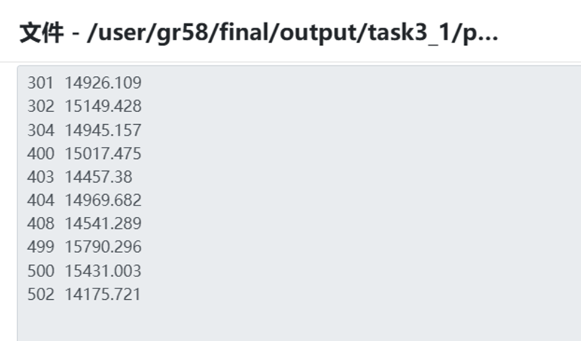
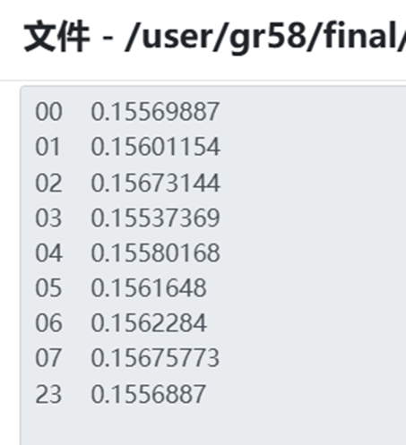
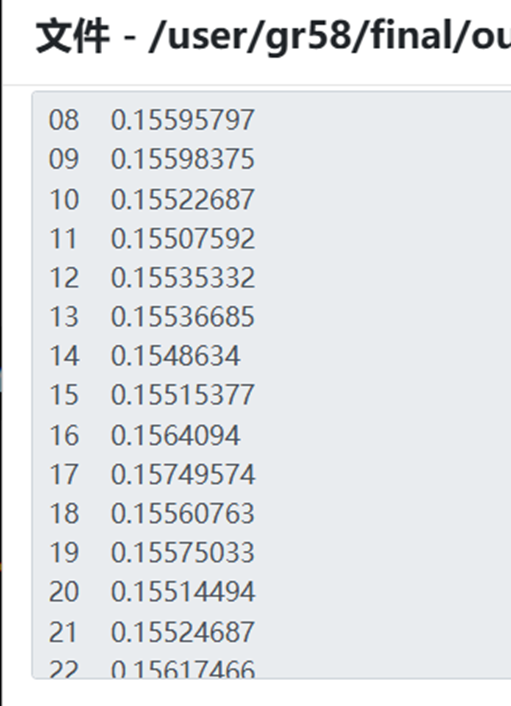
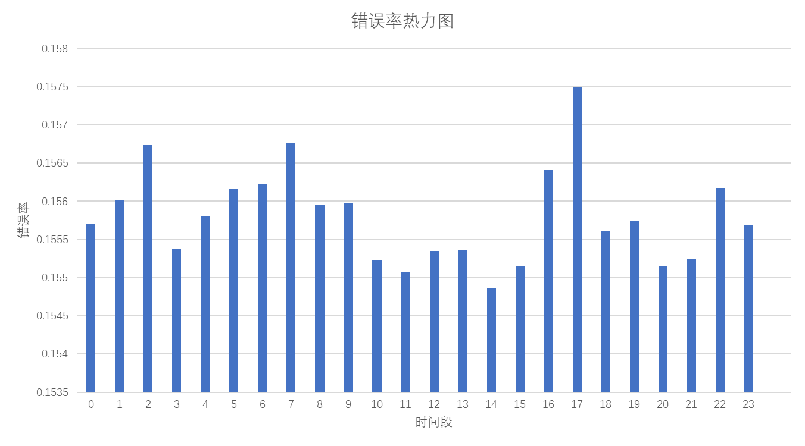
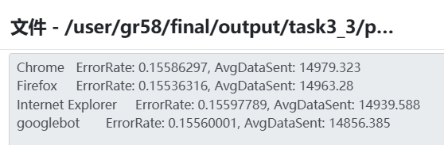
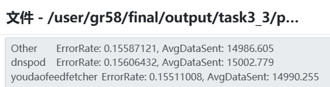
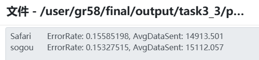

# 大数据课程设计2——LogAnalysis

## 小组信息&分工情况
项目地址：https://github.com/Jaderest/LogAnalysis

### 小组信息
[江思源 221840206, 廖琪 221220105]


### 分工情况
- 江思源：task3、task4的代码及实验报告
- 廖琪：task1、task2的代码及实验报告
- 共同完成实验环境搭建、代码测试、实验报告撰写、最终验收等工作

## 目录
- [大数据课程设计2——LogAnalysis](#大数据课程设计2loganalysis)
  - [小组信息\&分工情况](#小组信息分工情况)
    - [小组信息](#小组信息)
    - [分工情况](#分工情况)
  - [目录](#目录)
  - [详细设计说明](#详细设计说明)
    - [Task1](#task1)
      - [Mapper设计](#mapper设计)
      - [Reducer设计](#reducer设计)
      - [Partitioner设计](#partitioner设计)
      - [输出结果截图](#输出结果截图)
    - [Task2](#task2)
      - [代码设计](#代码设计)
        - [每小时网站浏览量](#每小时网站浏览量)
        - [访问网站的用户端类型](#访问网站的用户端类型)
        - [整合统计数据](#整合统计数据)
        - [排序实现](#排序实现)
      - [输出结果截图](#输出结果截图-1)
    - [Task3\_part1](#task3_part1)
      - [Mapper设计](#mapper设计-1)
      - [Reducer设计](#reducer设计-1)
      - [Partitioner设计](#partitioner设计-1)
      - [输出结果截图](#输出结果截图-2)
    - [Task3\_part2](#task3_part2)
      - [Mapper设计](#mapper设计-2)
      - [Reducer设计](#reducer设计-2)
      - [Partitioner设计](#partitioner设计-2)
      - [输出结果截图](#输出结果截图-3)
      - [分析](#分析)
    - [Task3\_part3](#task3_part3)
      - [Mapper设计（BrowserTypeMapper）](#mapper设计browsertypemapper)
      - [Reducer设计（BrowserTypeReducer）](#reducer设计browsertypereducer)
      - [Partitioner设计](#partitioner设计-3)
      - [输出结果截图](#输出结果截图-4)
      - [分析](#分析-1)
    - [Task4\_part1](#task4_part1)
      - [Mapper设计（LogMapper）](#mapper设计logmapper)
      - [Reducer设计（LogReducer）](#reducer设计logreducer)
      - [Partitioner设计](#partitioner设计-4)
    - [Task4\_part2](#task4_part2)
      - [特征选取与用户行为向量设计](#特征选取与用户行为向量设计)
      - [K-Means聚类算法聚类流程](#k-means聚类算法聚类流程)
      - [Mapper设计](#mapper设计-3)
      - [Combiner设计（和Reducer的核心逻辑一致）](#combiner设计和reducer的核心逻辑一致)
      - [聚类结果分析](#聚类结果分析)
      - [平台job截图](#平台job截图)

## 详细设计说明
- 本实验四个任务均采用MapReduce框架实现，环境如下
```
hadoop version: 3.2.1
openjdk version "1.8.0_452"
Apache Maven 3.6.3
```
- 基本框架为
  - Mapper
  - Partitioner（根据key将Mapper分出的内容传给不同的Reducer，由此提高代码的可扩展性，在更大的集群上也具有同样的扩展性）
  - Combiner（可选，通常用于对Mapper的输出进行局部聚合，减少传输数据量，此处仅用于K-means聚类算法中）
  - Reducer
  - Driver（负责将Mapper和Reducer连接起来，设置输入输出路径等）


### Task1

解析Nginx日志文件，提取关键字段信息，根据客户端IP地址进行数据分区处理，以此实现日志数据的结构化输出

设计思路：
使用正则表达式匹配提取包括IP地址、访问时间、请求URL、状态码等关键字段，同时根据IP地址的第一个八位字节实现数据分区

#### Mapper设计
- LogMapper类
  - 输入键值对：`<LongWritable, Text>`，`LongWritable`为行号，`Text`为原始日志行内容
  - 输出键值对：`<Text, Text>`，分别为IP地址和格式化后的日志信息
  - 代码如下：
    ```java
    Matcher matcher = logPattern.matcher(value.toString());
    if (matcher.find()) {
        String remoteAddr = matcher.group(1);
        StringBuilder sb = new StringBuilder();
        //按日志内容分类
        sb.append("remote_addr:").append(remoteAddr).append("\n");
        sb.append("remote_user:").append(matcher.group(2)).append(" ").append(matcher.group(3)).append("\n");
        sb.append("time_local:").append(matcher.group(4)).append("\n");
        sb.append("request:").append(matcher.group(5)).append("\n");
        sb.append("status:").append(matcher.group(6)).append("\n");
        sb.append("body_bytes_sent:").append(matcher.group(7)).append("\n");
        sb.append("http_referer:\"").append(matcher.group(8)).append("\"\n");
        sb.append("http_user_agent:\"").append(matcher.group(9)).append("\"\n");

       context.write(new Text(remoteAddr), new Text(sb.toString()));
    }
    ```

#### Reducer设计
- LogReducer类
- 输入键值对：`<Text, Iterable<Text>>`，`Text`为IP地址，`Iterable<Text>`为对应的日志信息集合
- 输出键值对：`<Text, NullWritable>`，`Text`为格式化后的日志信息
- 代码如下：
    ```java
    for (Text val : values) {
        context.write(val, NullWritable.get());
    }
    ```

#### Partitioner设计
- 根据IP地址的第一个八位字节分组
- 代码如下：
    ```java
    try {
        String ip = key.toString();
        String firstOctetStr = ip.split("\\.")[0]; // 取第一个字段
        int firstOctet = Integer.parseInt(firstOctetStr);
        return (firstOctet < 127) ? 0 : 1;
    } catch (Exception e) {
        // 如果>=127，默认分到 Reducer 1
        return 1;
    }
    ```

#### 输出结果截图
- 输出两个结果文件对应不同IP段
- 每个文件包含完整格式化的日志信息
样例输出示例如下:
  
平台全部数据输出示例如下:  

- 文件路径：`/user/gr58/final/output/task1`
- 平台job截图  
  

### Task2

统计每小时网站浏览量和访问网站的用户端类型，实现统计结果的排序输出

设计思路：使用两个独立MapReduce作业分别处理每小时网站浏览量统计和访问网站的用户端类型统计，再实现二次排序功能

#### 代码设计

##### 每小时网站浏览量
- `HourMapper`类
  - 输入键值对：`<LongWritable, Text>`，`LongWritable`为行号，`Text`为原始日志行内容
  - 输出键值对：`<Text, IntWritable>`，输出时间和计数1
  - 代码如下：
    ```java
    Matcher matcher = logPattern.matcher(value.toString());
    if (matcher.find()) {
        String hour = matcher.group(3) + matcher.group(2) + matcher.group(1) + matcher.group(4);
        context.write(new Text(hour), new IntWritable(1));
    }
    ```

##### 访问网站的用户端类型  
- `UserAgentMapper`类
  - 输入键值对：`<LongWritable, Text>`，`LongWritable`为行号，`Text`为原始日志行内容
  - 输出键值对：`<Text, IntWritable>`，输出客户端类型和计数1
  - 代码如下：
    ```java
    Matcher matcher = userAgentPattern.matcher(value.toString());
    if (matcher.find()) {
        String userAgent = matcher.group(1);
        String type = classifyUserAgent(userAgent);//判断是什么类型的客户端
        context.write(new Text(type), new IntWritable(1));
    }
    ```

##### 整合统计数据
- `SumReducer`类
  - 输入键值对：`<Text, IntWritable>`，`Text`为统计类型，`IntWritable`为统计次数1
  - 输出键值对：`<key, IntWritable>`，`Text`为统计类型（同输入键值对），`IntWritable`为该类型总出现次数
  - 代码如下：
    ```java
    int sum = 0;
    for (IntWritable val : values)
        sum += val.get();
    context.write(key, new IntWritable(sum));
    ```

##### 排序实现
- `SwapMapper类`
  - 交换键值对为`<计数, 类型>`
  - 代码如下：
    ```java
    String[] parts = value.toString().split("\t");
    if (parts.length == 2) {
        long count = Long.parseLong(parts[1]);
        context.write(new LongWritable(count), new Text(parts[0]));
    }
    ```
- `DescendingKeyComparator`类
  - 实现降序比较
  - 代码如下：
    ```java
    return -super.compare(a, b); // 降序排序
    ```
- `OutputReducer`类
  - 代码如下：
    ```java
    for (Text val : values) {
        context.write(val, key);
    }
    ```

#### 输出结果截图
**每小时网站浏览量统计**

  
平台截图如下  
  
Job如下  
  

**访问网站的用户端类型**

  
平台截图如下  
  
运行结果文件路径：`/user/gr58/final/output/task2`  
Job如下  
  


### Task3_part1
分析传输数据量与状态码的关系：根据body_bytes_sent字段和status字段，分析请求失败与大文件传输是否相关。

设计思路：根据状态码进行区分，统计每个状态码对应的body_bytes_sent字段的平均值，分析传输数据量与状态码的关系。使用`两个Reducer`对数据进行处理，一个Reducer处理状态码为2xx的请求（成功请求），另一个Reducer处理状态码为4xx和5xx的请求（失败请求）。

#### Mapper设计
- LogMapper类
  - 输入键值对：`(LongWritable, Text)`，其中LongWritable为行号，Text为原始日志行内容
  - 输出键值对：`(Text, FloatWritable)`，其中Text为状态码，FloatWritable为body_bytes_sent字段的值
- 代码如下：
```java
Matcher matcher = logPattern.matcher(value.toString());
if (matcher.find()) {
    String status = matcher.group(6); // 通过正则表达式获取状态码
    String bodyBytesSent = matcher.group(7); // 获取body_bytes_sent字段
    float dataSent = Float.parseFloat(bodyBytesSent);
    context.write(new Text(status), new FloatWritable(dataSent));
}
```

#### Reducer设计
- LogReducer类
  - 输入键值对：`<Text, Iterable<FloatWritable>>`，其中Text为状态码，Iterable<FloatWritable>为所有相同状态码的body_bytes_sent值
  - 输出键值对：`<Text, FloatWritable>`，其中Text为状态码，FloatWritable为body_bytes_sent的平均值
  - 代码如下：
    ```java
    float sum = 0;
    int count = 0;
    for (FloatWritable value : values) { // 统计同一状态码的所有发送数量
        sum += value.get();
        count++;
    }
    float average = sum / count;
    context.write(key, new FloatWritable(average));
    ```

#### Partitioner设计
- 根据状态码进行分组
- 代码如下：
  ```java
  if (status.equals("200") || status.equals("201") || status.equals("202") || status.equals("204")) {
    return 0;
  } else {
      return 1;
  }
  ```

#### 输出结果截图
- 输出结果为两个文件，分别对应状态码为2xx和4xx/5xx的请求
- 成功请求（2xx）输出示例：


- 失败请求（4xx/5xx）输出示例：


- 分析如下：
  - 请求成功失败与否和传输数据量并无太大关系
  - 只有一个499状态码比较可疑，499状态码通常出现在 Nginx 服务器日志中，表示 客户端主动关闭了请求连接
    - 同时客户端传输数据量较大，可能是因为客户端在传输大文件时超时，或是服务器生成大响应（如复杂查询、文件下载）耗时过长，导致用户失去耐心

- 平台job截图  
  

### Task3_part2
本任务以小时为粒度统计错误请求占比（即错误率），通过排序分析不同时间段内的错误率波动情况


#### Mapper设计
- 输入键值对：`<LongWritable, Text>`
- 输出键值对：`<Text, IntWritable>` Text表示时间段，IntWritable表示是否错误，不是错误则为0，是错误则为1
- 代码如下：
  ```java
  String status = matcher.group(6); // 请求状态码
  String timeLocal = matcher.group(4); // 获取访问时间
  // 将访问时间转换为小时
  Date date = sdf.parse(timeLocal);
  String hour = new SimpleDateFormat("HH").format(date);

  // 如果请求状态是失败（非200系列），则认为是错误
  nt isError = (status.startsWith("2")) ? 0 : 1;

  // 输出时间段（小时）和错误计数
  context.write(new Text(hour), new IntWritable(isError));
  ```

#### Reducer设计
- 对相同小时所有记录进行聚合
- 输入键值对：`Text, [IntWritable(isError)...]>`，其中Text为小时，IntWritable为是否为错误
- 输出键值对：`<Text, FloatWritable>`，输出小时和平均错误率
- 代码如下：
  ```java
  int totalRequests = 0;
  int failedRequests = 0;

  for (IntWritable value : values) {
      totalRequests++;
      if (value.get() == 1) {
          failedRequests++;
      }
  }

  float errorRate = totalRequests > 0 ? (float) failedRequests / totalRequests : 0.0f;
  context.write(key, new FloatWritable(errorRate));
  ```

#### Partitioner设计
LogPartitioner 将小时划分为白天（08~22）与夜间（00~07和23）两类，分别交由两个Reducer处理，以便观察昼夜之间错误率的差异。
代码如下：
```java
int hour = Integer.parseInt(key.toString());
// 将小时分为两组：8-22点 和 0-7点、23点
if (hour >= 8 && hour <= 22) {
    return 0; // 白天时间段
} else {
    return 1; // 夜间时间段
}
```

#### 输出结果截图
- 时间结果  


- 时间热力图  

- 平台job截图   


#### 分析
- 总体错误率波动较小
- 2点时间段，7点和16、17点错误率尤其高，可能是因为缺少维护或使用人数多流量过大，导致错误率升高


### Task3_part3
本任务旨在基于Web日志数据，结合浏览器类型，统计每种浏览器的请求错误率和平均传输数据量，并对错误率进行降序排序，识别风险较高的浏览器类型，辅助站点运维与防御策略制定。

任务分为两个MapReduce Job如下：
1. 统计浏览器的错误率与平均传输数据量（核心任务，使用了3个reducer）
2. 错误率排序：按照任务要求根据错误率进行降序排序

#### Mapper设计（BrowserTypeMapper）
- 输入：`<LongWritable, Text>`，其中LongWritable为行号，Text为原始日志行内容
- 输出：`<Text, Text>`，key为浏览器类型，值为`状态码:字节数`
- 代码如下：
```java
browser = classifyUserAgent(matcher.group(9)); // 提取浏览器类型
status = matcher.group(6); // 提取状态码
dataSent = matcher.group(7); // 提取传输数据量
// browserRank是setup阶段构造的map，读取任务2(2)的输出，将用户人数最高的十种浏览器类型存储在browserRank中
if (browserRank.containsKey(browser)) {
    // 输出键值对: 浏览器类型 -> 状态码: 错误/成功，数据量
    context.write(new Text(browser), new Text(status + ":" + dataSent));
}
```

#### Reducer设计（BrowserTypeReducer）
- 输入：`<Text, Iterable<Text>>`，其中Text为浏览器类型，Iterable<Text>为状态码和传输数据量的集合
- 输出：`<Text, Text>`，key为浏览器类型，值为`ErrorRate:x.xx,AvgDataSent:y.yy`
- 代码如下：
```java
int totalRequests = 0;
int failedRequests = 0;
float totalDataSent = 0;
// 计算每种浏览器类型下不同状态码的错误率与平均数据传输量
for (Text value : values) {
    String[] parts = value.toString().split(":");
    String status = parts[0];
    float dataSent = Float.parseFloat(parts[1]);
    totalRequests++;
    totalDataSent += dataSent;
    if (!status.startsWith("2")) { // 非200系列为失败请求
        failedRequests++;
    }
}
float errorRate = totalRequests > 0 ? (float) failedRequests / totalRequests : 0.0f;
float averageDataSent = totalRequests > 0 ? totalDataSent / totalRequests : 0.0f;
// 输出浏览器类型和相关的状态码统计信息
context.write(key, new Text("ErrorRate: " + errorRate + ", AvgDataSent: " + averageDataSent));
```

#### Partitioner设计
- 根据浏览器名的哈希值分配到不同的Reducer

#### 输出结果截图
- 错误率输出  
  
  
  

- 降序排序结果  


- 平台job截图


#### 分析
- 错误率的差值仅千分之一，平均数据传输量也很接近，无特别的异常浏览器类型

### Task4_part1
本部分主要是从日志文件中提取数据用以给part2阶段使用K-Means聚类算法进行用户分群，所以在设计的时候不同于手册，我尽可能将数据细化并提高区分度

#### Mapper设计（LogMapper）
- 输入：`<LongWritable, Text>`，其中LongWritable为行号，Text为原始日志行内容
- 输出：`<Text, Text>`，key为用户ID，value 为格式化的特征信息，包括设备类型、访问时间段、请求类型、发送字节数等
- 代码如下：
```java
// 提取 IP、时间戳、User-Agent 等字段
String remoteAddr = matcher.group(1);
String timeLocal = matcher.group(4);
String requestType = matcher.group(5);
String bytesSended = matcher.group(8);
String userAgent = matcher.group(10);

// 判断设备类型（PC端为1，移动端为0）
String deviceType = userAgent.toLowerCase().contains("mobile") ? "0" : "1";

// 判断访问时间段（6点至18点为白天，其余为夜晚）
String timeOfDay = classifyTimeOfDay(timeLocal);

// 构造输出特征向量格式
StringBuilder featureVector = new StringBuilder();
featureVector.append("device:").append(deviceType).append("\t");
featureVector.append("timeOfDay:").append(timeOfDay).append("\t");
featureVector.append("requestType:").append(requestType).append("\t");
featureVector.append("bytesSent:").append(bytesSended);

// 输出：<IP地址, 特征信息 + 请求次数计数1>
context.write(new Text(remoteAddr), new Text(featureVector.toString() + "\t1"));
```

#### Reducer设计（LogReducer）
- 输入：`<Text, Iterable<Text>>`，按IP聚合的特征集合
- 输出：`<Text, Text>`，key为IP地址，value为聚合后的完整行为特征向量
- 代码如下：
```java
// 解析日志特征字段
long totalRequestsDay = 0;
long totalBytesSentDay = 0;
long totalRequestsNight = 0;
long totalBytesSentNight = 0;
Map<String, Integer> requestTypeCount = new HashMap<>();
String deviceType = "";

// 遍历日志记录，进行分类统计
for (Text val : values) {
    String[] parts = val.toString().split("\t");
    if (deviceType.isEmpty()) {
        deviceType = parts[0].split(":")[1];
    }
    String timeOfDay = parts[1].split(":")[1];
    String requestType = parts[2].split(":")[1];
    long bytesSent = Long.parseLong(parts[3].split(":")[1]);

    requestTypeCount.put(requestType, requestTypeCount.getOrDefault(requestType, 0) + 1);

    if ("day".equals(timeOfDay)) {
        totalRequestsDay += 1;
        totalBytesSentDay += bytesSent;
    } else {
        totalRequestsNight += 1;
        totalBytesSentNight += bytesSent;
    }
}

// 计算平均值
double avgBytesSentDay = totalRequestsDay > 0 ? (double) totalBytesSentDay / totalRequestsDay : 0;
double avgBytesSentNight = totalRequestsNight > 0 ? (double) totalBytesSentNight / totalRequestsNight : 0;
long totalRequests = totalRequestsDay + totalRequestsNight;
double totalAvgBytesSent = totalRequests > 0
    ? (totalRequestsDay * avgBytesSentDay + totalRequestsNight * avgBytesSentNight) / totalRequests
    : 0;

// 构造请求类型向量，例如 [GET:10, POST:3]
StringBuilder requestTypeString = new StringBuilder();
for (Map.Entry<String, Integer> entry : requestTypeCount.entrySet()) {
    if (requestTypeString.length() > 0) requestTypeString.append(", ");
    requestTypeString.append(entry.getKey()).append(":").append(entry.getValue());
}

// 输出完整的特征向量
StringBuilder featureVector = new StringBuilder();
featureVector.append("deviceType:").append(deviceType).append("\t");
featureVector.append("requestTypes:[").append(requestTypeString).append("]\t");
featureVector.append("dayRequests:").append(totalRequestsDay).append("\t");
featureVector.append("dayAvgBytesSent:").append(avgBytesSentDay).append("\t");
featureVector.append("nightRequests:").append(totalRequestsNight).append("\t");
featureVector.append("nightAvgBytesSent:").append(avgBytesSentNight).append("\t");
featureVector.append("totalRequests:").append(totalRequests).append("\t");
featureVector.append("totalAvgBytesSent:").append(totalAvgBytesSent);

context.write(key, new Text(featureVector.toString()));
```

#### Partitioner设计
- 根据IP地址首字节划分，小于127的IP分到Reducer 0，大于等于127的分到Reducer 1
- 代码如下：
```java
public int getPartition(Text key, Text value, int numPartitions) {
    try {
        String ip = key.toString();
        int firstOctet = Integer.parseInt(ip.split("\\.")[0]);
        return (firstOctet < 127) ? 0 : 1;
    } catch (Exception e) {
        return 1; // 异常默认分到 1
    }
}
```

### Task4_part2
本部分主要是对Task4_part1的输出结果进行K-Means聚类分析，从而挖掘不同群体用户的典型行为特征，例如移动端夜间高频用户、白天大流量访问用户等，为个性化推荐、用户画像等应用构建基础

#### 特征选取与用户行为向量设计
- 特征选取
  - dayRequests：白天请求次数
  - dayAvgBytesSent：白天平均传输字节数
  - nightRequests：夜间请求次数
  - nightAvgBytesSent：夜间平均传输字节数
- 每个用户最终被表示为一个四维向量：
  `[dayRequests, dayAvgBytesSent, nightRequests, nightAvgBytesSent]`

#### K-Means聚类算法聚类流程
1. 初始中心设定
    在`Mapper`的`setup()`方法中预设两个初始聚类中心：
    - Cluster0:[10.0, 500.0, 8.0, 400.0]
    - Cluster1:[20.0, 1500.0, 30.0, 1300.0]
2. 距离计算与分配(Mapper)
    - 对每个用户行为向量，计算其与各个中心的欧式距离。
    - 将该用户分配到最近的聚类中心。
    - 输出格式为：
      ```
      <聚类编号, IP, dayReq, dayAvg, nightReq, nightAvg, 1>
      ```
3. 局部聚合(Combiner)
    - 对每个聚类编号的多个用户数据，进行局部合并，计算加权求和与频数
4. 全局聚合更新中心(Reducer)
    - 接收所有同一聚类编号的数据，重新计算聚类中心（即四个维度的加权平均）
5. 迭代执行

#### Mapper设计
- 提取用户行为向量并分配聚类
```java
double[] point = { dayRequests, dayAvgBytesSent, nightRequests, nightAvgBytesSent };
double distance = computeEuclideanDistance(point, center.getCenter());
```
- 输出格式
```java
context.write(new IntWritable(closestClusterId),
              new Text(ip + "," + dayRequests + "," + dayAvgBytesSent + "," +
                       nightRequests + "," + nightAvgBytesSent + ",1"));
```

#### Combiner设计（和Reducer的核心逻辑一致）
- 计算所有点的加权平均（中心更新）
```java
sum[0] += dayReq * freq;
sum[1] += dayAvg * freq;
...
newCenter[i] = sum[i] / count;
```

#### 聚类结果分析
- 四次迭代输出

- 可以发现数据逐渐趋于稳定
- 

#### 平台job截图
第0次迭代   
  
第1次迭代  
  
第2次迭代  
  
第3次迭代  
